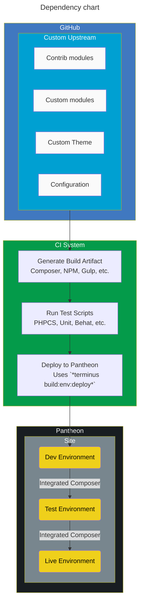
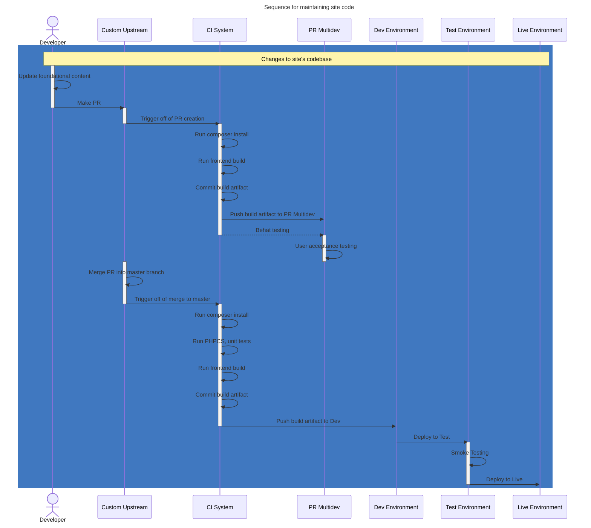

# Foundational codebase with compiled assets

Ideal for teams that

- have a lot of team members
- run a number of related, but not identical websites
- require high levels of governance over their sites
- are doing advanced or cutting edge technologies
- do a lot of testing of their codebase

Major elements of this setup

- Foundational codebase including core modules, themes, and configuration
- Can be used for many, many sites (scaling to the hundreds)
- The foundational codebase supports a full testing suite and a frontend build process
- The site repos can add additional modules, themes, and configuration on top of the foundation

