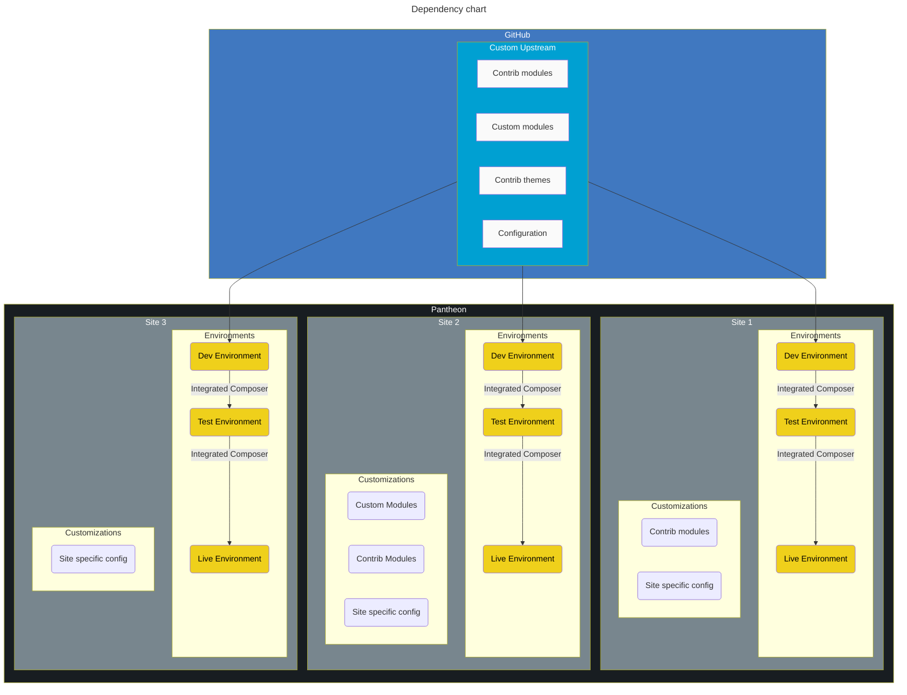
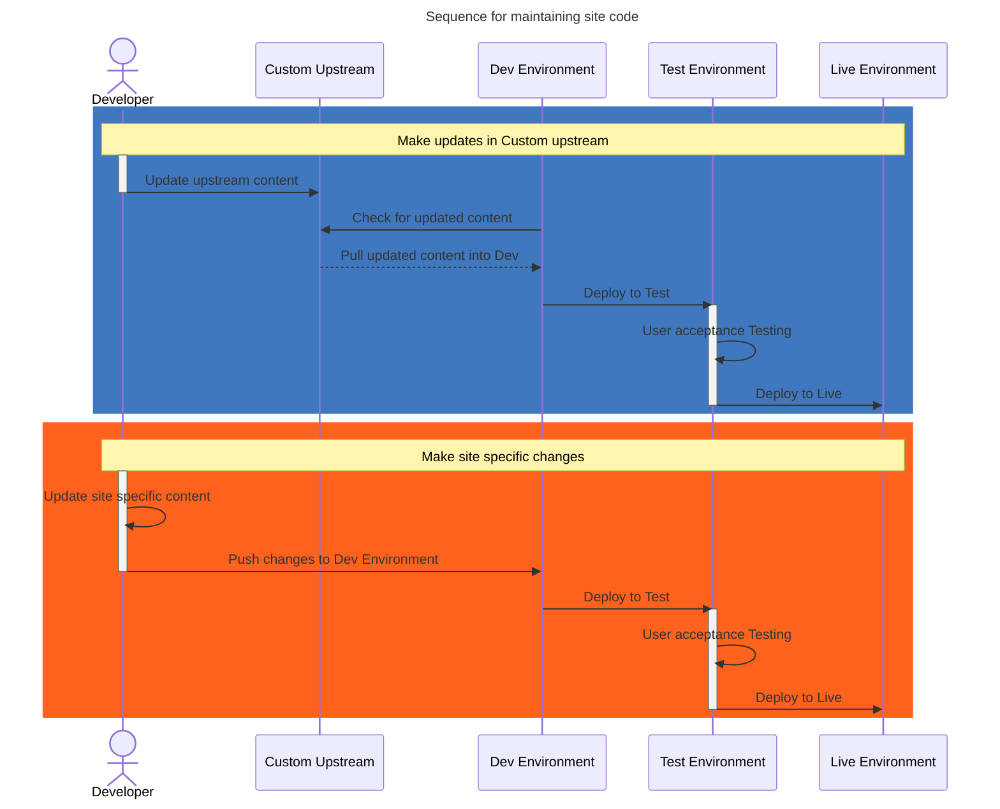

# Custom upstream

Ideal for teams that

- run a number of related, but not identical websites
- require high levels of governance over their sites
- do not use SASS or modern JS frameworks
- do not use automated testing systems

Major elements of this setup

- Foundational codebase including core modules, themes, and configuration
- Can be used for many, many sites (scaling to the hundreds)
- The site repos can add additional modules, themes, and configuration on top of the foundation

