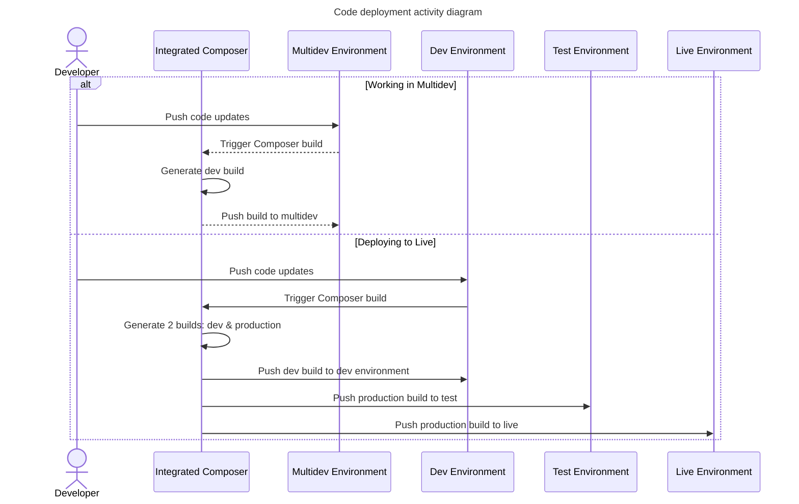

# Integrated Composer (IC)

At its most simple, it runs `composer install` command when you push code to the Pantheon platform.

IC generates two build artifacts. One includes dev dependencies. One excludes dev dependencies. The dev build gets used for the multidev or dev environment that triggered IC. The production build gets used for test and live environments.

