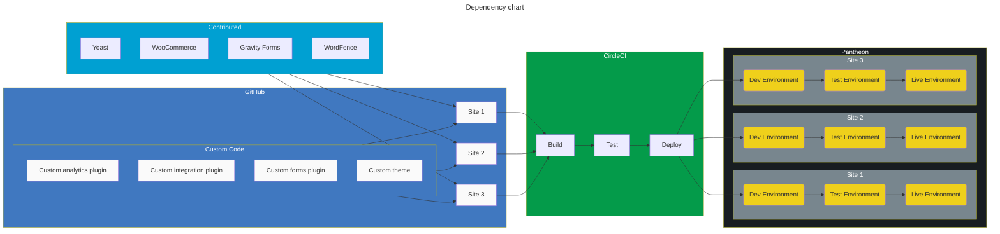
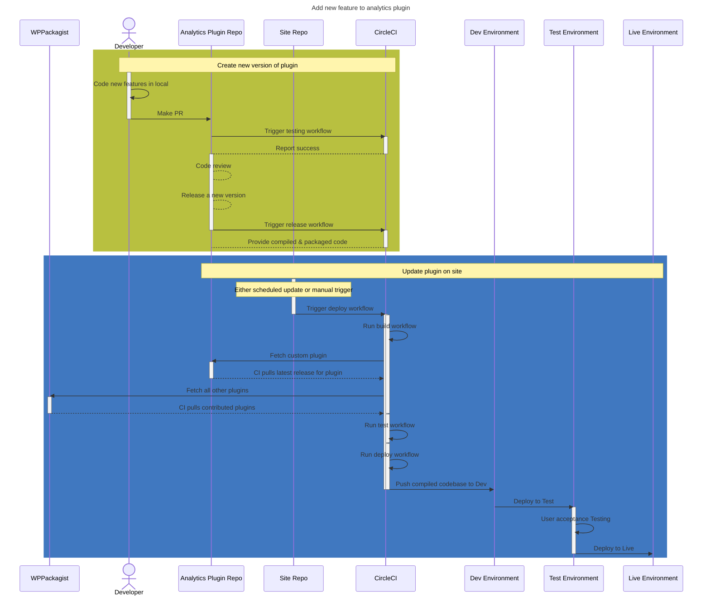

# Advanced Workflows

## Fully CI controlled

Ideal for teams that

- have a lot of team members
- run a number of related, but not identical websites
- require high levels of governance over their sites
- are doing advanced or cutting edge technologies
- do a lot of testing of their codebase

Major elements of this setup

- Custom plugins and themes are in their own repo
- The plugins & themes store pre-compiled versions of themselves
- The sites use Composer to define which plugins should get pulled in, including the custom plugins
- The site repos may just be the composer.json file and a few other config files
- CircleCI does all the heavy lifting moving code around

### Activity Diagram showing how changes move through the systems

