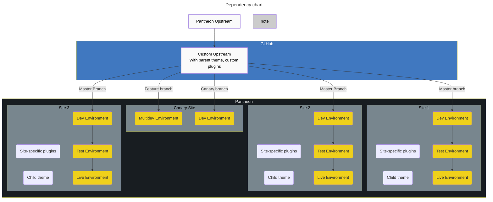
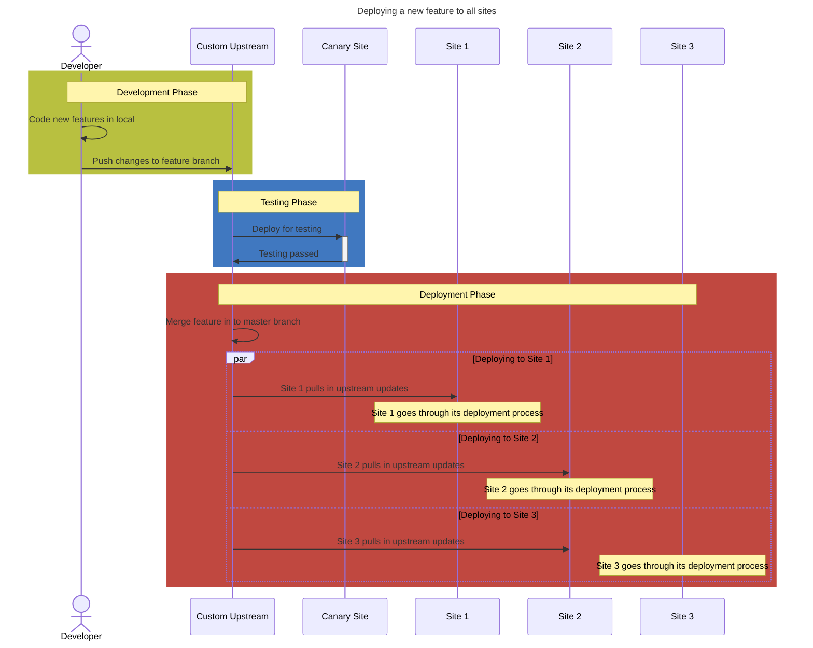
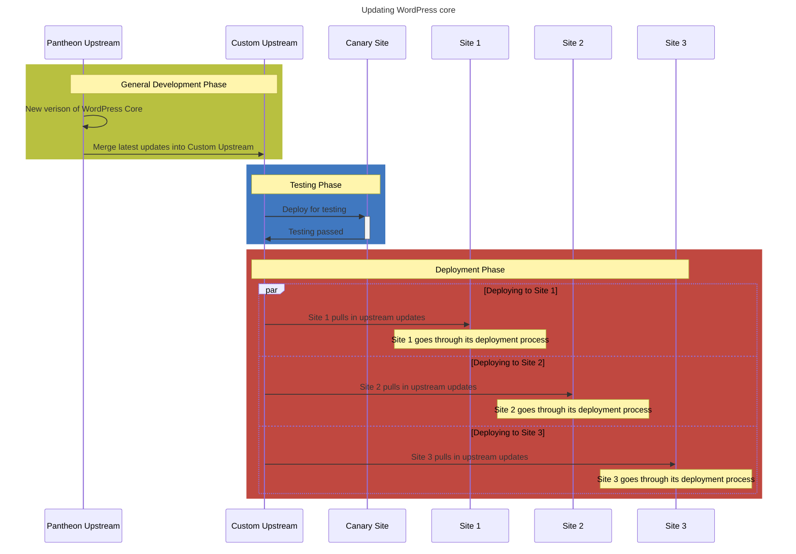
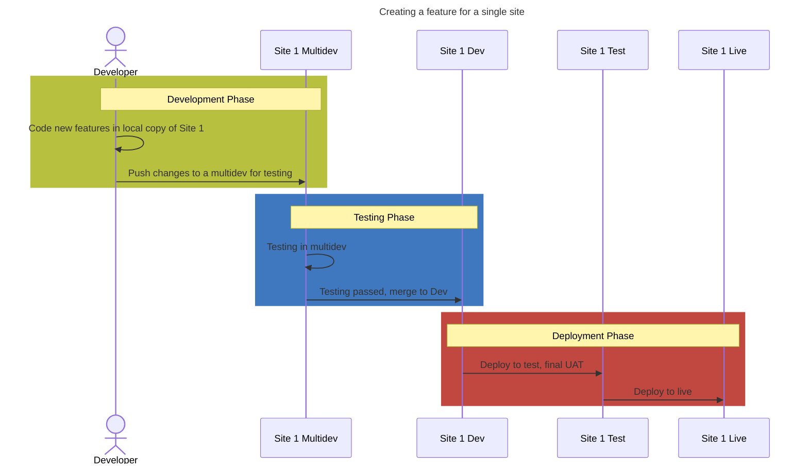
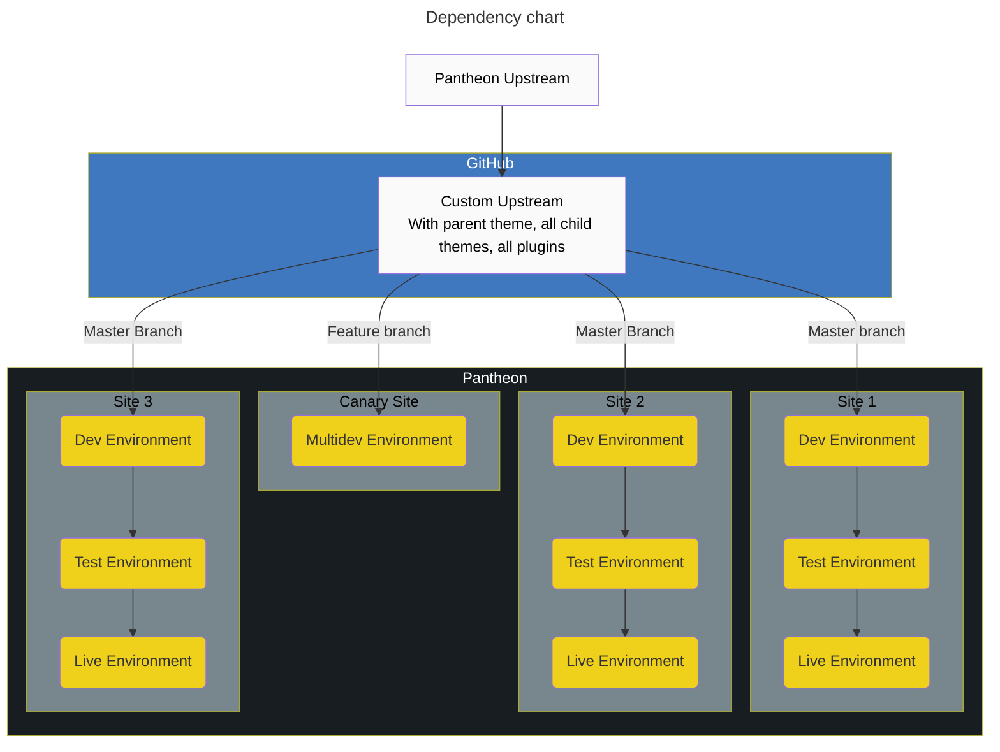
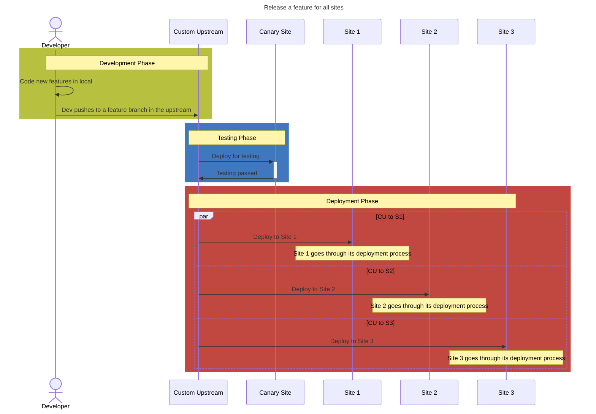
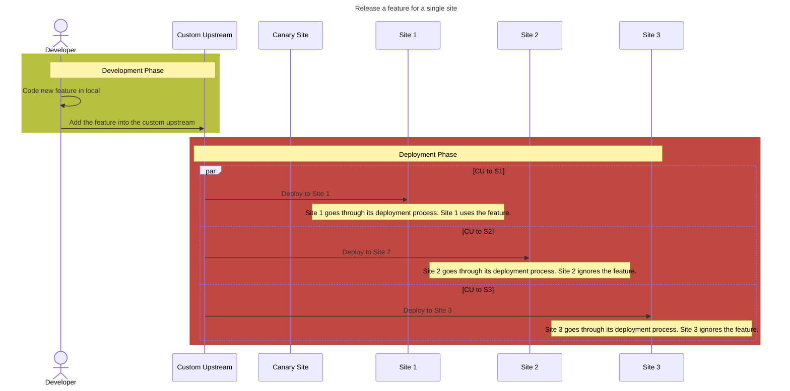

# Workflows that use custom upstreams

## Minimal Custom Upstream

In this setup, the company has

- A custom upstream that's based on the Pantheon default WordPress upstream
- The custom upstream has their standard custom theme and suite of plugins that all sites use
- The canary site uses the custom upstream "as-is". It's used for testing changes to the upstream before releasing it to the rest of the sites.
- Each site uses the theme and plugins from the upstream. They can also include a child theme and other plugins that they specifically need.
- A core developer team maintains the upstream and common codebase.
- Individual sites can be maintained by more developers that should have more limited access.

Useful for

- Teams with several developers
- Teams with developers at varying skillsets
- Teams that want to restrict some of their developers to a subset of the sites maintained
- Sites all share a common codebase but individual sites maintain their own plugins and theme.

@todo

- Canary diagram using multidevs on sites that are tagged with canary tag

### Dependencies in a minimal setup

### Processes for deploying code changes in a minimal setup

### Example Custom Upstream Code Structure

| Plugin / Theme | Managed Source |
|----------------|----------------|
| All-in-one SEO | Upstream       |
| Autoptimize    | Upstream       |
| Wordfence      | Upstream       |
| Custom Forms Plugin | Upstream  |
| Custom Parent Theme | Upstream  |
| Redirection    | Pantheon Site  |
| Custom Menu Plugin | Pantheon Site |
| Custom Child Theme | Pantheon Site |

### Custom Upstream User Permission Scope

| User Group | Primary Activity | System Access |
|------------|------------------|---------------|
| Senior Developers | Maintain overall strategy | Upstream Repo |
| Web Developers | Maintain all site content | Pantheon Deployments |
| Contractors | Maintain specific site content | Pantheon Development |

## Monorepo Setup

In this setup, the company has

- A custom upstream that's based on the Pantheon default WordPress upstream
- The custom upstream has all of the code for every site.
- The canary site uses the custom upstream "as-is". It's used for testing changes to the upstream before releasing it to the rest of the sites.
- Each site gets the full codebase deployed to it. They activate only the plugins and theme that it particularly needs to use.
- A CI script is often used to deploy the changes to all the sites en mass.

Useful for

- Teams with a few developers
- The team maintains a very large number of sites that run a very similar codebase

### Dependencies in a Monorepo setup

### Processes for deploying code changes in a monorepo setup

### Example Monorepo Code Structure

| Plugin / Theme | Managed Source | Used By   |
|----------------|----------------|-----------|
| All-in-one SEO | Upstream       | All sites |
| Autoptimize    | Upstream       | All sites |
| Wordfence      | Upstream       | All sites |
| Redirection    | Upstream       | One site  |
| Custom Forms Plugin | Upstream  | All sites |
| Custom Menu Plugin  | Upstream  | One site  |
| Custom Parent Theme | Upstream  | All sites |
| Custom Child Themes | Upstream  | One site  |
