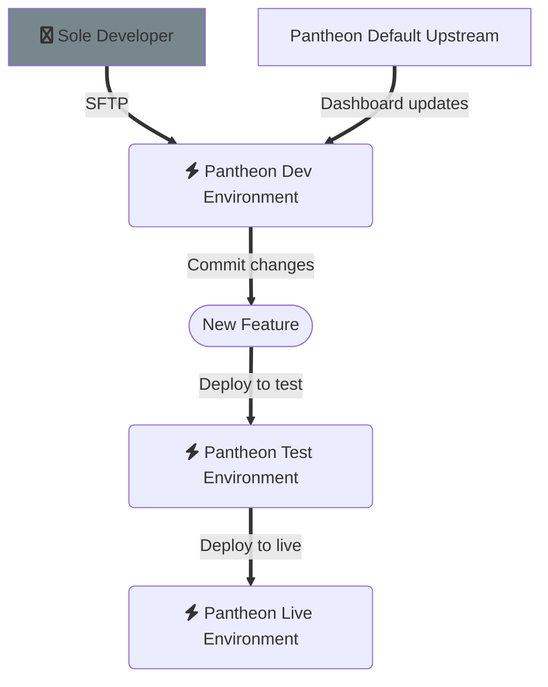

# Basic Dev/Test/Live workflow

```mermaid
graph TD
    User["fab:fa-user Sole Developer"] == SFTP ==> EnvDev("fas:fa-bolt Pantheon Dev Environment")
    Upstream["Pantheon Default Upstream"] == Dashboard updates ==> EnvDev
    EnvDev == Commit changes ==> Feat([New Feature])
    Feat == Deploy to test ==> EnvTest("fas:fa-bolt Pantheon Test Environment")
    EnvTest == Deploy to live ==> EnvLive("fas:fa-bolt Pantheon Live Environment")
    classDef env fill:#EFD01B stroke:#78868E
    class EnvDev,EnvTest,EnvLive env
    classDef user fill:#78868E
    class User user

```
