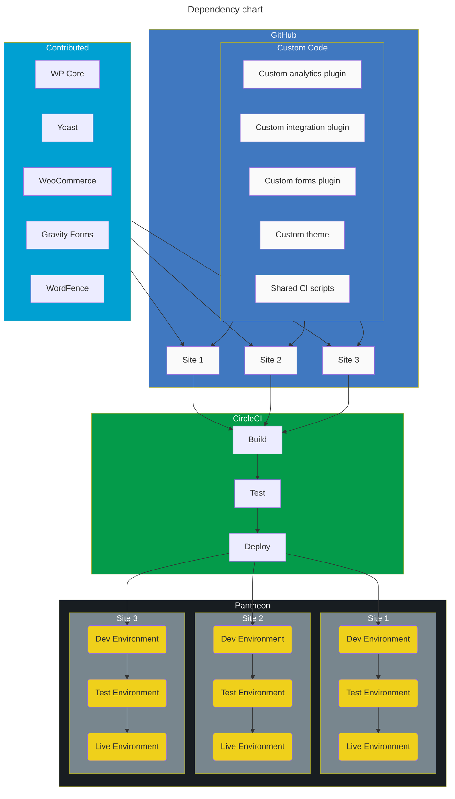
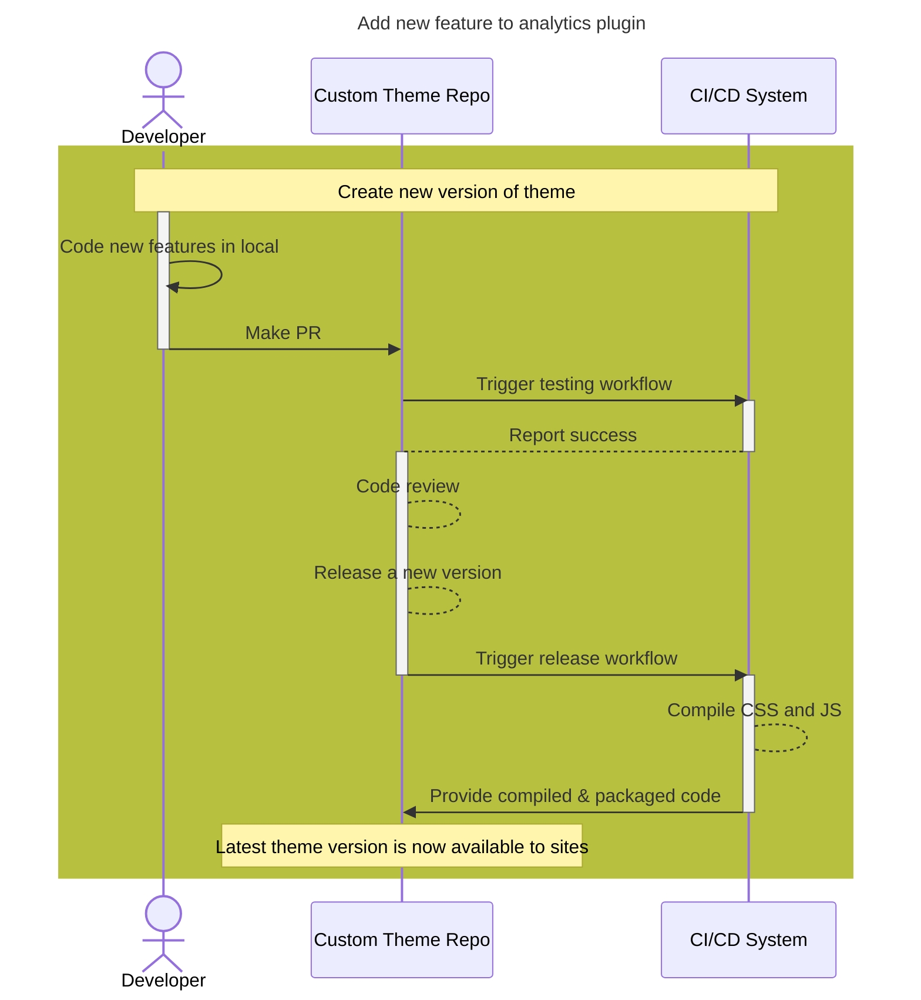
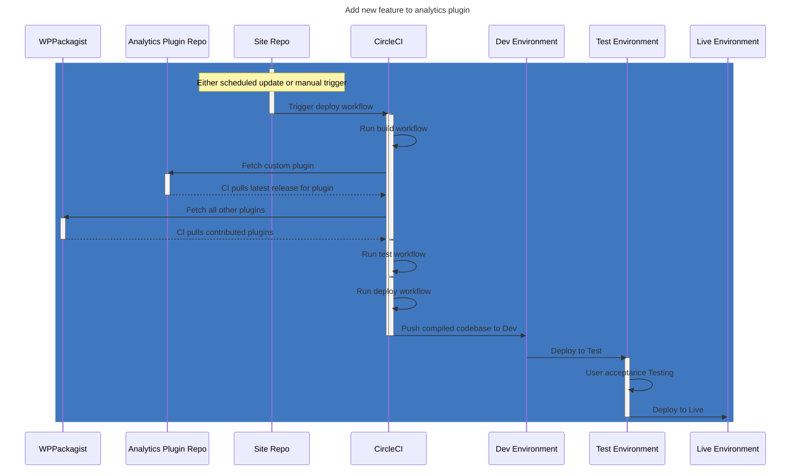

# Federated Codebase

A federated codebase refers to one in which there's no controlling upstream that dictates the code used by individual sites. Instead, your organization maintains a collection of plugins, themes, and other features - each of which is maintained seperately. Individual sites can "pick and choose" between the available packages to use the ones that they need.

This model gives a high level of control to individual sites, with the parent organization providing options rather than dictating a particular set of packages.

Ideal for teams that

- have a lot of team members
- run a number of related, but not identical websites
- require high levels of governance over their sites
- are doing advanced or cutting edge technologies
- do a lot of testing of their codebase

Major elements of this setup

- Custom plugins and themes are in their own repo
- The plugins & themes store pre-compiled versions of themselves
- The sites use Composer to define which plugins should get pulled in, including the custom plugins
- The site repos may just be the composer.json file and a few other config files
- CircleCI does all the heavy lifting moving code around

## High level dependency mapping



## Process for releasing a new version of a custom theme



## Process for updating plugins on a site



## Example composer.json for a custom package

You'll need to include a composer.json file to make a repo available for other sites to install. This is an example of what that would look like for a custom parent theme.

```json
{
    "name": "my-organization/theme",
    "version": "1.0.0",
    "description": "Common parent theme for my-organization",
    "type": "wordpress-theme",
    "require": {
        "composer/installers": "~2.0"
    }
}
```

## Example composer.json for a single site

This is an example composer.json file for a WordPress site. It installs the Bedrock version of WordPress core, some required Pantheon packages, a few plugins from the WordPress plugins repo, and the orgnaization's custom parent theme.

```json
{
    "name": "my-organization/shopping-site",
    "description": "Online store repository",
    "type": "project",
    "repositories": {
        "wpackagist": {
            "type": "composer",
            "url":"https://wpackagist.org",
            "only": [
                "wpackagist-plugin/*",
                "wpackagist-theme/*"
            ]
        },
        "my-org-theme": {
            "type": "github",
            "url": "git@github.com:my-organization/theme"
        }
    },
    "require": {
        "php": ">=8.0",
        "vlucas/phpdotenv": "^5.5",
        "oscarotero/env": "^2.1",
        "pantheon-systems/pantheon-mu-plugin": "*",
        "roots/bedrock-autoloader": "*",
        "roots/bedrock-disallow-indexing": "*",
        "roots/wordpress": "*",
        "roots/wp-config": "*",
        "roots/wp-password-bcrypt": "*",
        "wpackagist-plugin/akismet": "^5.3",
        "wpackagist-plugin/wordpress-seo": "^23.1",
        "wpackagist-plugin/woocommerce": "^9.1",
        "wpackagist-theme/twentytwentytwo": "^1.2",
        "my-organization/theme": "^1.0"
    },
    "config": {
        "allow-plugins": {
            "composer/installers": true
        }
    }
}
```
