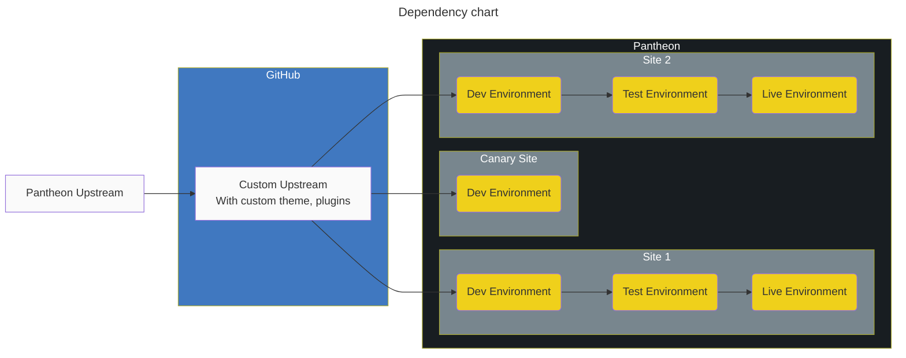
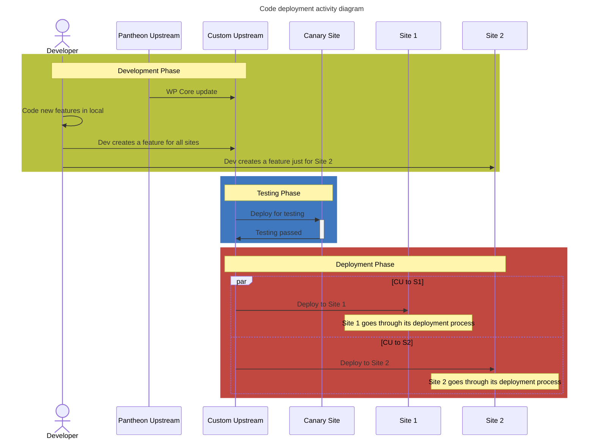
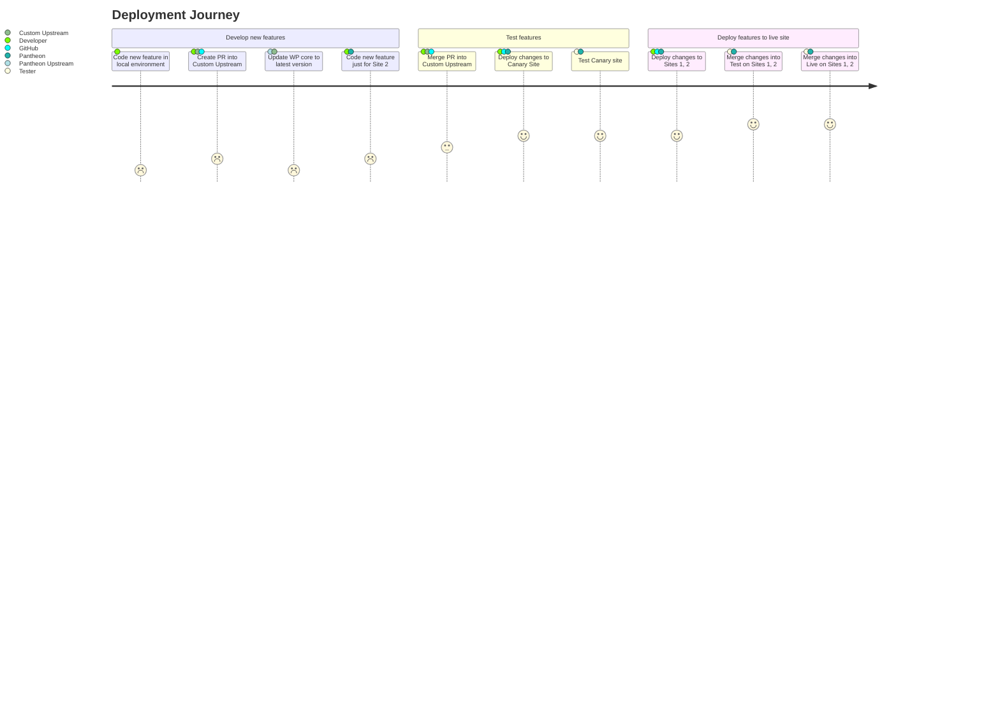

# Mid-level complexity workflows

## Custom Upstream

In this setup, the company has

- A custom upstream that's based on the Pantheon default WordPress upstream
- The custom upstream has their standard custom theme and suite of plugins that all sites use
- The canary site uses the custom upstream "as-is". It's used for testing changes to the upstream before releasing it to the rest of the sites.
- Each site uses the theme and plugins from the upstream. They can also include a child theme and other plugins that they specifically need.

Useful for

- Teams with a few developers
- The team maintains several websites that all share a common codebase

### Dependency chart showing how the systems connect to each other

### Activity Diagram showing how changes move through the systems

### User Journey showing who's involved at which stages

