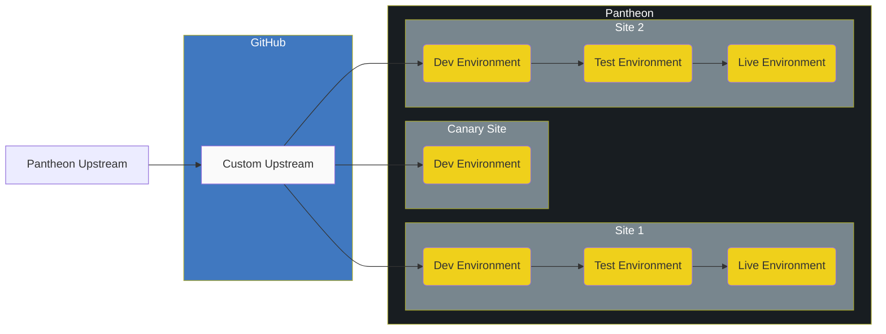
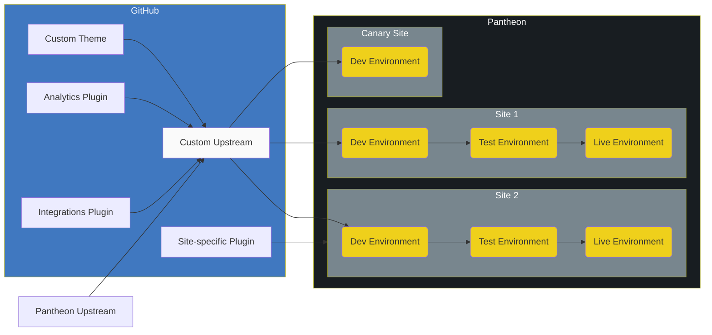

# Mid-level complexity workflows

In this setup, the company has

- A custom upstream that's based on the Pantheon default WordPress upstream
- The custom upstream has 

```mermaid
graph LR
    %% Nodes
    %%subgraph Developers
    %%	UserA[Senior Developer]
    %%	UserB[Contract Developer]
    %%end

    UpstreamPantheon["Pantheon Upstream"]

    subgraph github [GitHub]
        UpstreamCustom["Custom Upstream"]:::repo
    end

    subgraph pantheon [Pantheon]
        subgraph site0 [Canary Site]
            direction LR
            EnvDev0(Dev Environment):::env
        end

        subgraph site1 [Site 1]
            direction LR
            EnvDev1(Dev Environment):::env
            EnvTest1(Test Environment):::env
            EnvLive1(Live Environment):::env
        end

        subgraph site2 [Site 2]
            direction LR
            EnvDev2(Dev Environment):::env
            EnvTest2(Test Environment):::env
            EnvLive2(Live Environment):::env
        end
    end

    %% Links
    
    UpstreamPantheon --> UpstreamCustom

    UpstreamCustom --> EnvDev0
    UpstreamCustom --> EnvDev1
    UpstreamCustom --> EnvDev2

    %% UserA --> GitHub
    %% UserA --> EnvDev1
    %% UserA --> EnvDev2
    %% UserB --> EnvDev2

    EnvDev1 --> EnvTest1
    EnvTest1 --> EnvLive1

    EnvDev2 --> EnvTest2
    EnvTest2 --> EnvLive2

    %% Styles
    style github fill:#4078c0,color:#FFF
    style pantheon fill:#181D21,color:#FFF
    style site0 fill:#78868E,color:#FFF
    style site1 fill:#78868E,color:#FFF
    style site2 fill:#78868E,color:#FFF
    classDef env fill:#EFD01B
    classDef repo fill:#fafafa

```

```mermaid
graph LR
    %% Nodes
    %%subgraph Developers
    %%	UserA[Senior Developer]
    %%	UserB[Contract Developer]
    %%end

    UpstreamPantheon["Pantheon Upstream"]

    subgraph github [GitHub]
        UpstreamCustom["Custom Upstream"]:::repo
        Theme1["Custom Theme"]
        Plugin1["Analytics Plugin"]
        Plugin2["Integrations Plugin"]
        Plugin3["Site-specific Plugin"]
    end

    subgraph pantheon [Pantheon]
        subgraph site0 [Canary Site]
            direction LR
            EnvDev0(Dev Environment):::env
        end

        subgraph site1 [Site 1]
            direction LR
            EnvDev1(Dev Environment):::env
            EnvTest1(Test Environment):::env
            EnvLive1(Live Environment):::env
        end

        subgraph site2 [Site 2]
            direction LR
            EnvDev2(Dev Environment):::env
            EnvTest2(Test Environment):::env
            EnvLive2(Live Environment):::env
        end
    end

    %% Links
    
    UpstreamPantheon --> UpstreamCustom
    Theme1 --> UpstreamCustom
    Plugin1 -->UpstreamCustom
    Plugin2 -->UpstreamCustom
    Plugin3 -->site2

    UpstreamCustom --> EnvDev0
    UpstreamCustom --> EnvDev1
    UpstreamCustom --> EnvDev2

    %% UserA --> GitHub
    %% UserA --> EnvDev1
    %% UserA --> EnvDev2
    %% UserB --> EnvDev2

    EnvDev1 --> EnvTest1
    EnvTest1 --> EnvLive1

    EnvDev2 --> EnvTest2
    EnvTest2 --> EnvLive2

    %% Styles
    style github fill:#4078c0,color:#FFF
    style pantheon fill:#181D21,color:#FFF
    style site0 fill:#78868E,color:#FFF
    style site1 fill:#78868E,color:#FFF
    style site2 fill:#78868E,color:#FFF
    classDef env fill:#EFD01B
    classDef repo fill:#fafafa

```