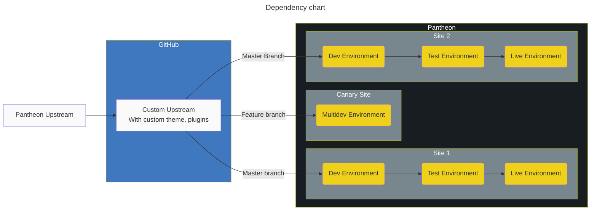
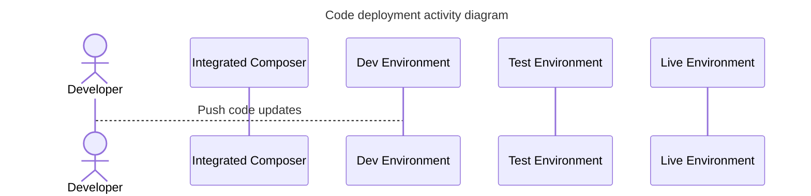

# Mid-level complexity workflows

## Simple Custom Upstream Setup

In this setup, the company has

- A custom upstream that's based on the Pantheon default WordPress upstream
- The custom upstream has their standard custom theme and suite of plugins that all sites use
- The canary site uses the custom upstream "as-is". It's used for testing changes to the upstream before releasing it to the rest of the sites.
- Each site uses the theme and plugins from the upstream. They can also include a child theme and other plugins that they specifically need.

Useful for

- Teams with a few developers
- The team maintains several websites that all share a common codebase

@todo

- Canary diagram using multidevs on sites that are tagged with canary tag

### Dependency chart showing how the systems connect to each other

### Activity Diagram showing how changes move through the systems

### Integrated Composer

At its most simple, it runs `composer install` command when you push code to the Pantheon platform.

You can use it to define some system attributes and to run various PHP-specific build tasks (using composer hooks).

