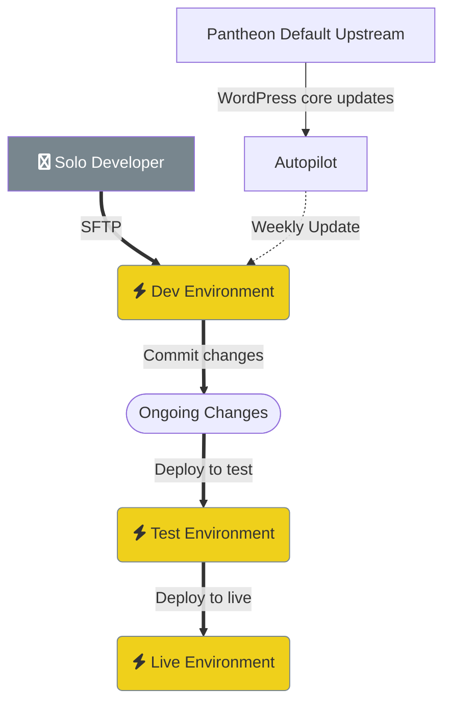
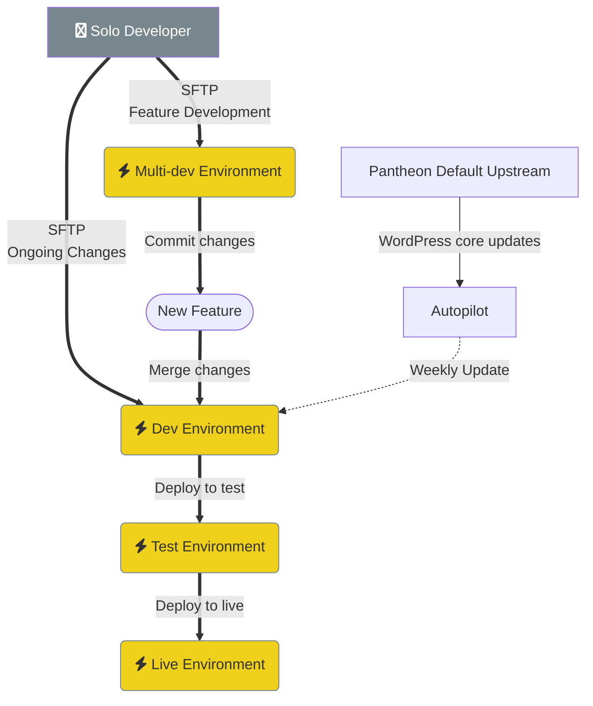
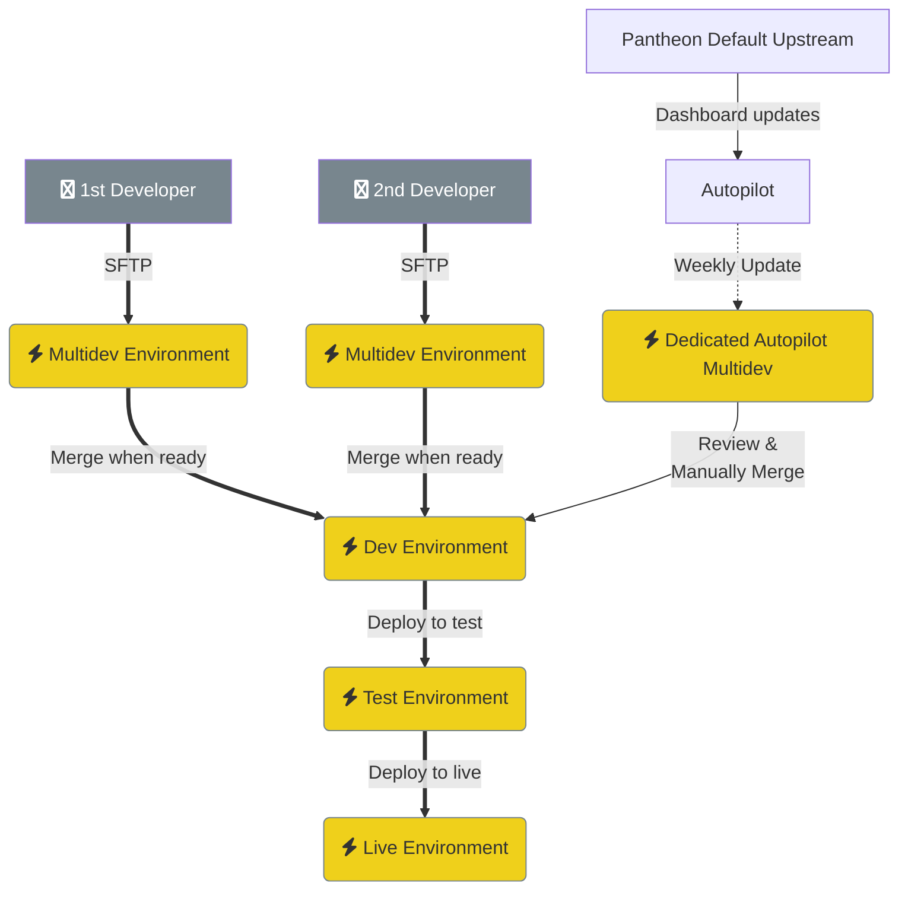

# Simple workflows using only the Pantheon framework

## Ongoing changes in Dev environment only

Best for a solo developer working on a website.

The developer edits files on the dev environment using SFTP. They don't have to worry about running a local environment. However, the flow doesn't easily support multiple developers as they will overwrite each others' changes.

Autopilot will update all plugins and the upstream (WordPress Core) on a regular basis. It can either leave the updates in Dev for the developer to deploy or automatically deploy them to Live.

## Feature development in a multi-dev

Best for a solo developer, or a very small team.

The developer makes ongoing small changes directly on the dev environment using SFTP. For any significant features, they spin up a multidev where that work is isolated.

Autopilot will update all plugins and the upstream (WordPress Core) on a regular basis. It can either leave the updates in Dev for the developer to deploy or automatically deploy them to Live.

## Multiple developers isolated in multidevs

Best for small teams who don't develop large amounts of code.

Each developer has their own multidev where they do their work in isolation. After they're ready to deploy their work, they merge it into the Dev environment and then through Test & Live.

If the two developers often work on the same plugins or theme files, then they may run into a number of merge conflicts. Those conflicts can be very hard to resolve if they don't have familiarity with Git and locally cloned copies of the site.

Autopilot will update plugins and the upstream (WordPress Core) on a regular basis. Those updates go into a dedicated multidev. The dev team deploys those updates to dev/test/live after they've reviewed the changes.

